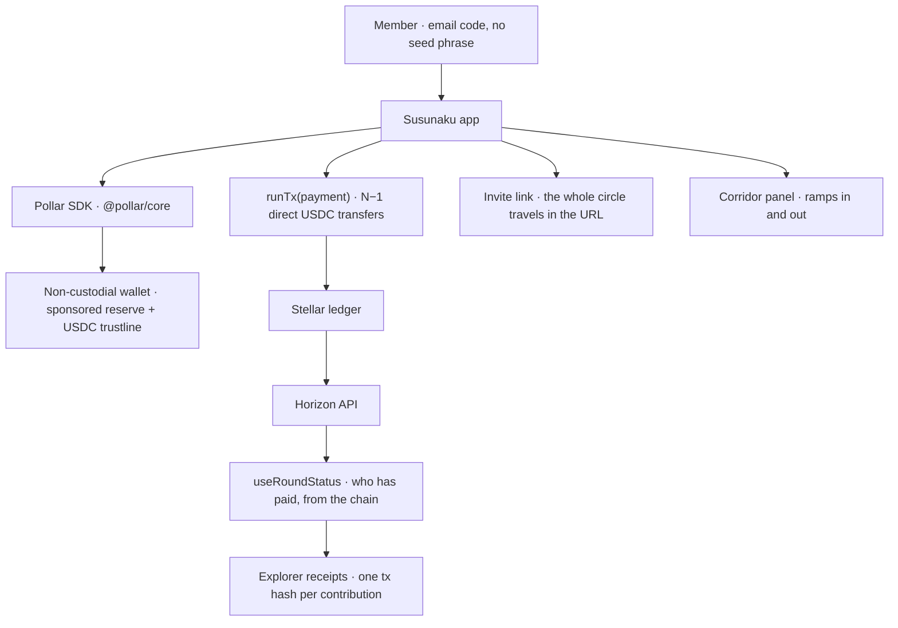

<div align="center">


# Susunaku

**Rotating savings circles where nobody holds the money.**

Each round, every member pays that round's recipient directly, in USDC on Stellar.
Nothing is ever pooled, so there is no custodian, no float and no pot to steal.
Round status is read back from the chain, so *"did she pay?"* is a fact anyone can
check rather than a claim in a notebook.

[**Live app**](https://susunaku.sithunyein.com) · [How it works](https://susunaku.sithunyein.com/#/how) · [Pollar SDK docs](https://docs.pollar.xyz) · [Source](https://github.com/thesithunyein/susunaku) · [Explorer](https://stellar.expert/explorer/testnet)

[](https://susunaku.sithunyein.com)


[](./LICENSE)
[](./CONTRIBUTING.md)
[](./SECURITY.md)
[](./CODE_OF_CONDUCT.md)

The name blends two names for the same institution: *susu* (West Africa) and
*pasanaku* (the Andes).

</div>

## Why

A savings circle concentrates everything into one person — organiser, collector, treasurer,
record-keeper. That is a single point of failure as well as a single point of trust: when they
disappear, whoever's turn it was loses everything and the circle dies with them.

The digital tools that exist have mostly rebuilt the notebook (due dates, reminders, reports)
while the cash still lands in someone's hands. Susunaku changes the movement itself:

| | Traditional circle | Susunaku |
|---|---|---|
| Who holds the money | The organiser | Nobody |
| Record of payment | A notebook | The chain |
| A member abroad | Locked out | In the same circle |
| If the organiser leaves | Savings gone | Nothing to take |
| Unit of account | Local currency that drifts | USDC |

## How a round works

1. **Contribute** — every member except the round's recipient pays that recipient, wallet to wallet.
2. **Settle** — USDC on Stellar, ~5 seconds, a hundredth of a cent in fees.
3. **Verify** — status is derived from Horizon, with a transaction hash per contribution.

Members sign in with an email code. Pollar creates a non-custodial Stellar wallet, pays the
account's reserves and opens its USDC trustline, so nobody needs a seed phrase or a browser
extension. A Stellar *payment's* fee is charged to the sender's own XLM — see
[Fees, honestly](#fees-honestly).

## Quickstart

Requires Node 20+.

```bash
npm install
cp .env.example .env.local     # optional: bake in your key and network
npm run dev                    # http://localhost:5187
```

The app needs **HTTPS or localhost**: Pollar's auth uses WebCrypto/DPoP, which browsers only
expose in a secure context.

### 1. Get a Pollar key

Create an app at <https://dashboard.pollar.xyz> → **Build → API Keys** and copy the
**publishable** key (`pub_testnet_…`). Testnet keys are issued immediately. Either paste it into
the app once (it is remembered on that device), or set it at build time:

```bash
VITE_POLLAR_PUBLISHABLE_KEY=pub_testnet_xxx
VITE_STELLAR_NETWORK=testnet
```

Add your origin (e.g. `http://localhost:5187` and your production domain) to
**Build → Domains** in the dashboard, or the SDK will refuse the requests.

Never put a `sec_…` key in this repo — secret keys belong on a backend. A `pat_…` personal access
token is also not usable here: Pollar's client endpoints answer `API_KEY_TYPE_NOT_ALLOWED`.

### 2. Get two testnet wallets that can hold USDC

A circle needs at least two members, and a member has to be able to *receive* USDC, which on
Stellar means the account needs a trustline — a bare Friendbot account cannot be one:

```bash
npm run member:new -- Ama        # funded account with the USDC trustline open
```

For USDC on testnet use the [Circle faucet](https://faucet.circle.com/), or fund the wallet Pollar
creates for you once you sign in. If a wallet has no XLM it cannot submit a payment:

```bash
npm run fund:gas -- G...ADDRESS 5
```

### 3. Create a circle

New circle → amount, cadence, members and their addresses → **Create**. Copy the invite link:
the entire circle (amount, cadence, members, rotation order) travels inside the link, so the other
members just open it. Nothing is registered on a server for a circle to exist.

## Fees, honestly

Three separate things, and only two are free:

- **Wallet reserves and the USDC trustline** — sponsored by Pollar. A member needs no XLM to *hold*
  USDC.
- **A payment's network fee** — charged in XLM to the sending account. Pollar's transaction options
  for a Stellar payment are `{ timeoutSec, memo, maxFeeStroops }`: there is **no fee-sponsorship
  option in the SDK**, and the client refuses to build a payment from a wallet holding zero XLM.
  The operator-side fix is **Dashboard → Treasury → Sponsorship** (tick `payment`) with a funded gas
  wallet, plus **Account Funding** so new wallets start with spendable XLM.
- **Cost per payment** — measured on testnet: **0.00001 XLM** per contribution.

The app warns before the click when a contributor's wallet has no XLM, rather than failing after it.

## Going to mainnet

Real money needs four things, in this order:

1. **Identity verification with Pollar.** Their model verifies the person, not a corporation —
   testnet is instant, mainnet is an automated personal check.
2. A **`pub_mainnet_`** key for your app.
3. `VITE_STELLAR_NETWORK=mainnet` at build time (the USDC issuer switches to Circle's mainnet asset
   automatically — see `src/lib/config.ts`).
4. Members funded with real USDC.

The UI refuses a key whose network disagrees with the build, and shows a red warning on mainnet
because contributions are irreversible.

## Deploy

Live at **https://susunaku.sithunyein.com** — Vercel project `susunaku`, source at
[github.com/thesithunyein/susunaku](https://github.com/thesithunyein/susunaku).

The build is a static bundle, so any static host works.

**Vercel** (what production uses)

```bash
vercel link --project susunaku   # first time only
vercel --prod
```

The domain is already attached to the project and `sithunyein.com` is on Vercel's own nameservers,
so DNS and TLS are automatic — every `vercel --prod` republishes the live URL.

Connecting the key on production:

```bash
vercel env add VITE_POLLAR_PUBLISHABLE_KEY production   # pub_testnet_... or pub_mainnet_...
vercel env add VITE_STELLAR_NETWORK production          # testnet | mainnet
vercel --prod
```

Static hosts that read a `CNAME` file (GitHub Pages, Cloudflare Pages) already have
`public/CNAME` set to `susunaku.sithunyein.com`.

## Architecture



Nothing in that diagram is a server we run: the app is a static bundle, the wallet is the
member's own, the record is the ledger, and the directory is the link itself.

### Source map

Every file in the repository, what it does, and its size. No hidden directories, no "and some
glue": the app is small enough to read in an afternoon, on purpose.

```
susunaku/
├─ index.html                 25   shell, meta/OG tags, favicon, theme colour
├─ vite.config.ts             14   Vite + React plugin, dev-server allow-list
├─ tsconfig.json              20   strict TypeScript, bundler resolution
├─ vercel.json                 8    SPA rewrites for the hash router
├─ package.json               30    scripts; deps: react, @pollar/core, stellar-sdk
├─ .env.example                8    VITE_POLLAR_PUBLISHABLE_KEY, VITE_STELLAR_NETWORK
│
├─ src/
│  ├─ main.tsx               19   root: PollarGateway → LangProvider → App
│  ├─ App.tsx               222   hash router, top bar, menu, countdown pill, auth sheet
│  ├─ gaze-frames.json       72   70-row calibration: gaze angle → video frame time
│  ├─ data/
│  │  └─ names.ts            31   18 regional names for the same institution
│  ├─ lib/
│  │  ├─ pollar.tsx         718   the @pollar/core gateway: auth, wallet, balance, ramps, pay
│  │  ├─ i18n.tsx           206   en/es/pt dictionary, context, persistence, detection
│  │  ├─ corridor.ts        154   Africa ⇄ LatAm legs: live vs designed, honestly labelled
│  │  ├─ circle.ts          145   the model: cadences, round maths, rotation, velocity
│  │  ├─ stellar.ts         145   Horizon lookups; matches a payment to its round window
│  │  ├─ useRoundStatus.ts  112   who has paid, derived from the chain — never stored
│  │  ├─ store.ts            74   local circle store (localStorage + invite links)
│  │  ├─ config.ts           71   network, USDC issuers, Horizon + explorer URLs
│  │  ├─ format.ts           58   countdowns, amounts, addresses
│  │  └─ share.ts            47   the whole circle encoded into one URL
│  ├─ components/
│  │  ├─ AuthPanel.tsx      318   sign-in, email-code flow, wallet card
│  │  ├─ CorridorPanel.tsx  314   money in / money out, from the SDK's own ramp list
│  │  ├─ icons.tsx          264   inline SVG set incl. official Google + GitHub marks
│  │  ├─ chrome.tsx         170   top bar, menu, footer, language switcher
│  │  ├─ HeroToy.tsx        142   the mascot: cursor-scrub video, mobile loop
│  │  ├─ art.tsx             81   the mascot as static mark + lockup
│  │  └─ Disclosure.tsx      46   collapsed sections — answer first, detail on request
│  ├─ pages/
│  │  ├─ Home.tsx           628   the round: stats, who-has-paid, receipts, invite, pay
│  │  ├─ CreateCircle.tsx   336   amount, cadence, members, rotation order
│  │  ├─ Info.tsx           172   How it works + Network & key
│  │  └─ JoinCircle.tsx      52   arriving from an invite link
│  └─ styles/
│     ├─ app.css          1287   the flat editorial system, every component
│     └─ tokens.css         116   colour, type, radius, spacing variables
│
├─ public/
│  ├─ favicon.svg            12   the mascot on the cream tile
│  ├─ mark.svg               25   the mascot, standalone
│  ├─ logo.svg               29   horizontal lockup with wordmark
│  ├─ toy-scrub.mp4         4.2MB 169-frame all-intra encode, seekable per frame
│  ├─ fonts/                       Epilogue-Black.woff2, DMSans-Variable.woff2 (self-hosted)
│  └─ CNAME                        susunaku.sithunyein.com
│
├─ scripts/
│  ├─ check-pollar.mjs      181   probe the SDK endpoints the app depends on
│  ├─ verify-leg.mjs        162   read a payment off Horizon, reconcile both balances
│  ├─ fund-gas.mjs           79   send XLM so a wallet can pay network fees
│  ├─ make-testnet-account.mjs 76  funded keypair via Friendbot
│  └─ make-usdc-member.mjs   73   funded member with the USDC trustline open
│
└─ docs (repo root)
   ├─ README.md             287   this file
   ├─ SUBMISSION.md         177   the four judge questions, evidence, verify steps
   ├─ SECURITY.md            43   threat model for a keyless static app
   ├─ CONTRIBUTING.md        53   the two architecture rules, how to build, test, PR
   ├─ CODE_OF_CONDUCT.md     32   short, project-specific
   └─ LICENSE                      MIT
```

The two biggest files tell the whole story: `pollar.tsx` (718 lines) is the entire bank — every
privileged interaction the app has with money, in one auditable place — and `app.css`
(1,287 lines) is the entire look. Everything else is smaller than its name.

Design decisions worth knowing:

- **The interface is flat by construction.** Hierarchy comes from type, weight and space — an
  Epilogue Black headline against DM Sans body — not from bordered cards. White is spent only
  where content genuinely needs containment: a value panel, a row that is a record, the sheet.
- **Rounds are never pooled.** The recipient of a round receives N−1 direct payments. This is what
  removes the custodian, and it is also why nothing here needs a licence to hold funds.
- **We do not keep a payment ledger.** `useRoundStatus` asks Horizon what actually moved, and
  matches on sender, recipient, asset, amount and the round's time window — so a payment from last
  round cannot be counted twice.

## What is real, and what is not

Working now: non-custodial wallets behind an email login; real USDC contributions signed by each
member's own wallet; round confirmation from Horizon with explorer receipts; circles shared
entirely by link; and a money-in/money-out panel that reads its corridors from the SDK.

Signed out, the app is *empty* rather than populated with someone else's data: no placeholder
stats, no account panels for an account the visitor does not have, and starting a circle asks for
an account first — because a circle is built from the creator's own wallet address. The one path
that deliberately needs no account is an invite link: the whole circle travels in the URL, so an
invited member sees the live round and is asked to sign in only to pay.

Not solved yet, and stated plainly:

- **Default risk.** If a member never pays, the recipient is short that round. The chain makes the
  defaulter visible; it does not make them pay. Collateral or pre-funded rounds are next.
- **Cash-out** runs through Pollar's ramps — Bolivia (BOB), Brazil (Pix), Colombia (BreB), Mexico
  (SPEI), plus a SEP-24 adapter. Every one of them is Latin American: mobile money in Africa is the
  leg that does not exist yet, and the corridor panel says so rather than inventing a route.
- No offline/USSD entry point yet — a smartphone is required.
- Circles live in local storage plus the invite link; there is no hosted directory of circles.
- Testnet. The verified round in [SUBMISSION.md](./SUBMISSION.md) moved USDC on Stellar testnet, not
  mainnet.

Susunaku never takes custody, never pools funds and never guarantees a payout. Anything that changed
that would change the regulatory picture, so it is out of scope on purpose.

## Scripts

```bash
npm run dev          # dev server on :5187
npm run build        # typecheck + production bundle to dist/
npm run typecheck    # tsc --noEmit
npm run preview      # serve the built bundle
npm run member:new   # mint a funded testnet member with a USDC trustline
npm run fund:gas     # send XLM to a wallet so it can pay Stellar fees
npm run verify:leg   # verify a payment leg on Horizon (sender recipient [minAmount])
npm run pollar:check # probe the SDK endpoints this app depends on
```

`verify:leg` exits non-zero unless a matching payment exists *and* the recipient's balance
reconciles, so it is usable in CI as well as by hand.

## Contributing

Pull requests are welcome — see [CONTRIBUTING.md](./CONTRIBUTING.md) for the setup and the
rules of the road. By participating you agree to the [Code of Conduct](./CODE_OF_CONDUCT.md).

## Security

Found something? Do not open a public issue — see [SECURITY.md](./SECURITY.md). The short
version: this app never holds keys, so the highest-severity class of bug lives in the SDK and
the ledger rather than here; report anything that looks like custody, key handling, or a way to
fake a `paid` state as high priority.

## License

[MIT](./LICENSE) — free to fork, run and remix. The mascot is the project's identity; if you
fork the code, drawing your own character is the polite thing to do.
